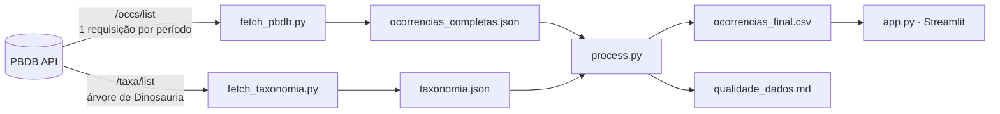

<div align="center">

# 🦖 Dino Fossil Dashboard

### Onde os dinossauros foram encontrados? Um mapa interativo de 22 mil fósseis, 95 países e 190 milhões de anos

[](https://www.python.org)
[](https://streamlit.io)
[](https://plotly.com/python/)
[](https://python-visualization.github.io/folium/)
[](https://paleobiodb.org)
[](LICENSE)

<!-- DEMO: depois do deploy, troque "#demo" abaixo pelo link do Streamlit Cloud (https://<seu-app>.streamlit.app) -->
**[🔴 Demo ao vivo](https://dino-fossil-dashboard.streamlit.app/) · [💡 Destaques](#-destaques-dos-dados) · [📊 Visualizações](#-visualizações) · [⚙️ Pipeline](#️-pipeline-de-dados) · [⚡ Como rodar](#-como-rodar)**

</div>

---

## 🎬 Demo

<!-- GIF/VÍDEO: salve a gravação como docs/demo.gif e descomente a linha abaixo
     (ou, no editor web do GitHub, arraste o .mp4 para cá — ele gera o link do vídeo automaticamente) -->
<!--  -->

## Sobre o projeto

App interativo em **Streamlit** alimentado por dados reais da **[Paleobiology Database (PBDB)](https://paleobiodb.org)**, uma base científica colaborativa, pública e sem necessidade de autenticação.

O projeto cobre o ciclo completo de análise de dados:

1. **Coleta** paginada da API, contornando o limite de registros por requisição
2. **Limpeza** de coordenadas e padronização de mais de uma centena de nomes de estágios geológicos em três períodos
3. **Enriquecimento** com país e continente (geocodificação reversa) e família taxonômica (percorrendo a árvore filogenética da PBDB)
4. **Relatório de qualidade** gerado automaticamente ([`docs/qualidade_dados.md`](docs/qualidade_dados.md))
5. **Visualização** interativa com filtros combináveis

---

## 💡 Destaques dos dados

| | |
|---|---|
| 🦴 **22.064** ocorrências fósseis | 🌎 **95** países · **11.038** sítios de escavação |
| 🧬 **2.192** espécies e **150** famílias identificadas | ⏳ do Triássico (~252 Ma) ao fim do Cretáceo (~66 Ma) |

**O que o mapa revela:**

- 🇺🇸 **Os EUA concentram 31% de todas as ocorrências.** Somados a China e Canadá, os três países respondem por quase **metade** do registro fóssil de dinossauros.
- 🦕 **73% dos registros são do Cretáceo**, contra 22% do Jurássico e apenas 5% do Triássico.
- 🇧🇷 **O Brasil aparece em 9º lugar** no ranking, com 536 ocorrências, e **92% delas são do Cretáceo**, com destaque para abelissaurídeos e titanossauros.
- 🔍 **O mapa mostra onde se escavou mais, não necessariamente onde viveram mais dinossauros.** A concentração reflete décadas de investimento em pesquisa, afloramentos acessíveis e preservação geológica: é um caso clássico de **viés de amostragem**.

---

## 📊 Visualizações

| Aba | O que mostra | Tecnologia |
|-----|-------------|-----------|
| 🌍 **Mapa** | Mapa de calor global + clusters clicáveis com detalhes de cada sítio de escavação; enquadra automaticamente o país ou continente filtrado | Folium · HeatMap · FastMarkerCluster · Esri / OSM |
| ⏳ **Timeline** | Diversidade de espécies por período, empilhada pelas 10 principais famílias, com marcação da extinção K-Pg | Plotly · Barras empilhadas |
| 🏆 **Países & Clados** | Top 15 países com mais registros + treemap família → táxon | Plotly · Barras horizontais · Treemap |
| 📅 **Gêneros** | Surgimento e desaparecimento dos 30 gêneros mais registrados | Plotly · Gantt |

**Filtros na sidebar** (combináveis): período geológico · continente · família taxonômica · país.
Os cards de resumo no topo (registros, espécies, países e famílias) se atualizam a cada filtro, e só a aba aberta é recalculada.

---

## ⚙️ Pipeline de dados



| Etapa | Script | O que faz |
|-------|--------|-----------|
| Coleta | `src/fetch_pbdb.py` | Uma requisição por período (Triássico, Jurássico, Cretáceo), com retentativas, deduplicação por `oid` e validação de colunas obrigatórias |
| Taxonomia | `src/fetch_taxonomia.py` | Baixa a hierarquia completa de Dinosauria (`rel=all_children`) |
| Processamento | `src/process.py` | Normaliza coordenadas → mapeia estágios geológicos para `era` → geocodifica país/continente → resolve a família subindo a árvore taxonômica → trata nulos → gera o relatório de qualidade |
| Visualização | `app.py` + `src/charts.py` | Dashboard com dados em cache (`st.cache_data`) e uma função por gráfico |

---

## 🧪 Qualidade dos dados e limitações

Ser transparente sobre os dados faz parte da análise:

- **51,5% dos registros não têm família atribuída** ("Desconhecido"). Muitos fósseis só são identificados em níveis mais amplos (ex.: *Theropoda*, *Sauropoda*) ou são pegadas e ovos sem família formal.
- **Nem todo nome é uma espécie.** A coluna `tna` traz o táxon aceito em qualquer nível. São 2.818 táxons distintos, dos quais 2.192 em nível de espécie (`rnk = 3`).
- **País e continente vêm das coordenadas atuais**, não da posição dos continentes na época (paleocoordenadas).
- **Viés de amostragem:** a densidade de pontos reflete esforço de pesquisa, não apenas a distribuição real dos animais.

O relatório completo de completude por coluna está em [`docs/qualidade_dados.md`](docs/qualidade_dados.md).

---

## ⚡ Como rodar

### Pré-requisitos

- Python 3.11 ou superior
- Internet apenas se quiser recoletar os dados (o dataset processado já está no repositório)

### Instalação

```bash
# 1. Clonar o repositório
git clone https://github.com/yDiegoRosa/Fossil-Dashboard.git
cd Fossil-Dashboard

# 2. Criar e ativar o ambiente virtual
python -m venv .venv
.venv\Scripts\activate           # Windows
# source .venv/bin/activate      # Linux / macOS

# 3. Instalar dependências
pip install -r requirements.txt
```

### Rodar o dashboard

```bash
streamlit run app.py
```

Acesse `http://localhost:8501`, aplique filtros na sidebar e explore as abas.

### (Opcional) Recoletar e reprocessar os dados

A coleta e o processamento usam dependências extras (geocodificação reversa), que o app não precisa:

```bash
pip install -r requirements-pipeline.txt
python src/fetch_pbdb.py        # ocorrências → data/raw/ocorrencias_completas.json
python src/fetch_taxonomia.py   # taxonomia   → data/raw/taxonomia.json
python src/process.py           # limpeza     → data/processed/ocorrencias_final.csv + docs/qualidade_dados.md
```

### Consultar a API diretamente

```python
import requests
import pandas as pd

r = requests.get(
    "https://paleobiodb.org/data1.2/occs/list.json",
    params={"base_name": "Dinosauria", "show": "coords,coll,time", "interval": "Jurassic"},
    timeout=60,
)
df = pd.DataFrame(r.json()["records"]).dropna(subset=["lat", "lng"])
print(df[["tna", "lat", "lng", "oei"]].head(10))
```

> A PBDB usa nomes de campos compactos (`tna`, `oei`, `eag`...). O mapeamento completo está em [`docs/api_pbdb.md`](docs/api_pbdb.md).

---

## 📁 Estrutura do projeto

```
Fossil-Dashboard/
├── app.py                        # app principal Streamlit
├── coleta.py                     # exploração inicial dos endpoints da PBDB
├── requirements.txt              # dependências do app (usado no deploy)
├── requirements-pipeline.txt     # + dependências da coleta e do processamento
├── LICENSE
├── .streamlit/
│   └── config.toml               # tema escuro fixo
├── data/
│   ├── raw/
│   │   ├── ocorrencias_completas.json   # ocorrências coletadas por período (entrada do pipeline)
│   │   ├── ocorrencias.json             # primeira coleta (versão sem paginação)
│   │   ├── taxonomia.json               # árvore taxonômica de Dinosauria
│   │   └── sitios.json                  # sítios de escavação
│   └── processed/
│       ├── ocorrencias_clean.csv        # após limpeza de coordenadas
│       └── ocorrencias_final.csv        # dataset final usado pelo app
├── docs/
│   ├── api_pbdb.md               # endpoints, parâmetros e dicionário de campos
│   └── qualidade_dados.md        # relatório de completude (gerado pelo process.py)
├── notebooks/                    # análise exploratória (em construção)
│   ├── 01_exploracao_api.ipynb
│   ├── 02_limpeza_dados.ipynb
│   └── 03_visualizacoes.ipynb
└── src/
    ├── fetch_pbdb.py             # coleta paginada de ocorrências (principal)
    ├── fetch_taxonomia.py        # coleta da hierarquia taxonômica
    ├── fetch_sitios.py           # coleta de sítios (formação geológica e ambiente)
    ├── fetch_ocorrencias.py      # coleta simples, substituída pelo fetch_pbdb.py
    ├── process.py                # limpeza, enriquecimento e relatório
    ├── traducoes.py              # nomes em português de períodos, continentes e países
    └── charts.py                 # uma função por visualização
```

---

## 🗂️ Dataset processado

`data/processed/ocorrencias_final.csv` · 22.064 linhas · 27 colunas. As principais:

| Coluna | Origem | Descrição |
|--------|--------|-----------|
| `oid` / `cid` | PBDB | ID da ocorrência / ID do sítio de coleta |
| `tna` | PBDB | Nome do táxon aceito |
| `rnk` | PBDB | Nível taxonômico (3 = espécie, 5 = gênero, ...) |
| `oei` / `oli` | PBDB | Intervalo geológico inicial / final |
| `eag` / `lag` | PBDB | Idade máxima / mínima (milhões de anos) |
| `lat` / `lng` | PBDB | Coordenadas atuais do sítio |
| `cnm` | PBDB | Nome do sítio de coleta |
| `era` | **derivada** | Período normalizado: Triassic, Jurassic ou Cretaceous |
| `cc` / `pais` / `continente` | **derivadas** | País e continente via geocodificação reversa |

Período, país e continente ficam em inglês no CSV (como vêm da PBDB e do pycountry) e são traduzidos ao carregar o app ([`src/traducoes.py`](src/traducoes.py)).
| `familia` | **derivada** | Família taxonômica resolvida pela árvore da PBDB |

---

## 🧰 Stack

| Categoria | Tecnologia |
|-----------|-----------|
| App web | [Streamlit](https://streamlit.io) |
| Dados | [pandas](https://pandas.pydata.org) · [NumPy](https://numpy.org) |
| Mapas | [Folium](https://python-visualization.github.io/folium/) + [streamlit-folium](https://pypi.org/project/streamlit-folium/) |
| Gráficos | [Plotly](https://plotly.com/python/) |
| Geocodificação | [reverse_geocoder](https://pypi.org/project/reverse_geocoder/) · [pycountry-convert](https://pypi.org/project/pycountry-convert/) |
| Fonte de dados | [Paleobiology Database API v1.2](https://paleobiodb.org/data1.2/) |

---

## 🚀 Deploy

O app foi pensado para o **Streamlit Community Cloud**, sem banco de dados nem credenciais:

1. Faça fork deste repositório
2. Acesse [share.streamlit.io](https://share.streamlit.io) e conecte sua conta do GitHub
3. Selecione o repositório e defina `app.py` como arquivo principal
4. Em **Advanced settings**, escolha Python 3.11 ou superior e clique em **Deploy**

O Streamlit Cloud instala só o `requirements.txt`, que traz apenas o necessário para o app.

---

## 🔭 Próximos passos

- [ ] Publicar o deploy no Streamlit Cloud
- [ ] Integrar `sitios.json` (formação geológica e ambiente de deposição) ao dataset final
- [ ] Usar paleocoordenadas para mostrar os fósseis na posição dos continentes da época
- [ ] Completar os notebooks de exploração, limpeza e visualização

---

## 👤 Autor

**Diego Rosa**: Cientista de dados, estudante de Análise e Desenvolvimento de Sistemas

[](https://www.linkedin.com/in/rdiegosilva)
[](https://github.com/yDiegoRosa)

---

## 📄 Licença

Código distribuído sob a licença MIT. Veja [LICENSE](LICENSE).

Dados da [Paleobiology Database](https://paleobiodb.org), sob licença [CC BY 4.0](https://creativecommons.org/licenses/by/4.0/).

---

<div align="center">
Feito com Python, Streamlit e dados de 190 milhões de anos de história 🦖
</div>
